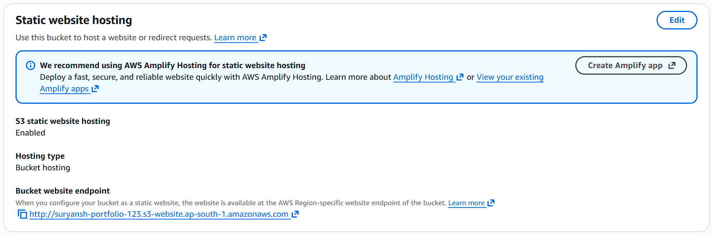
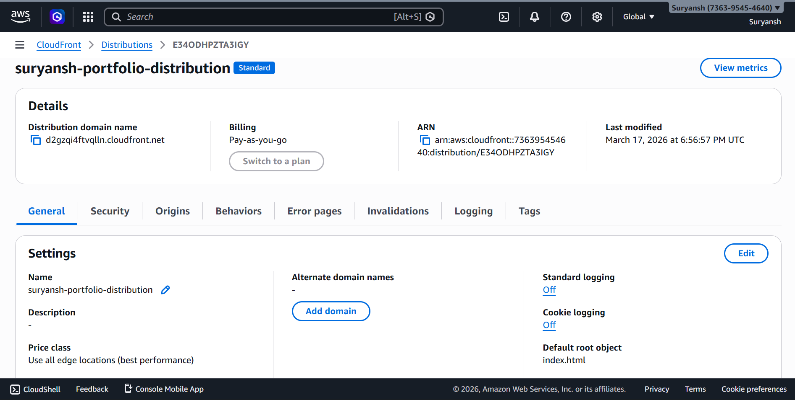
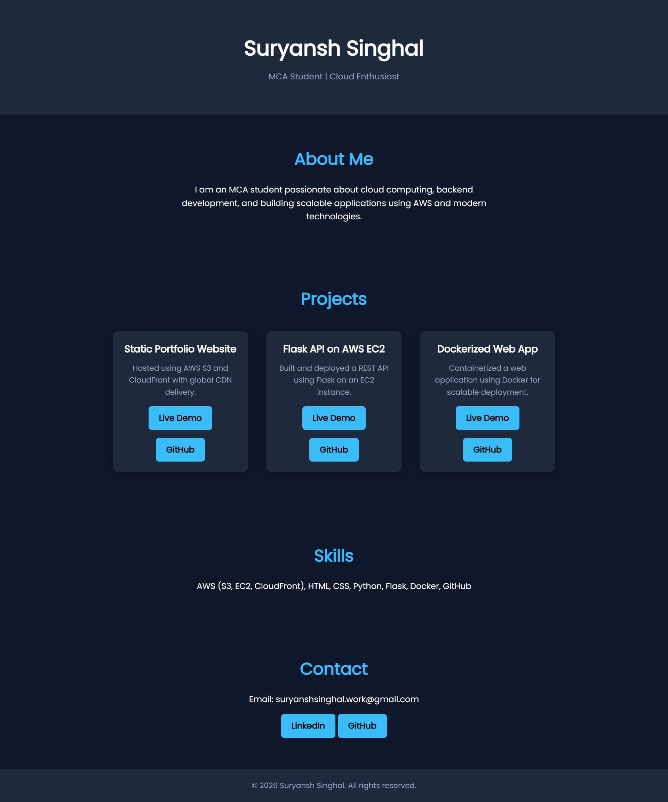
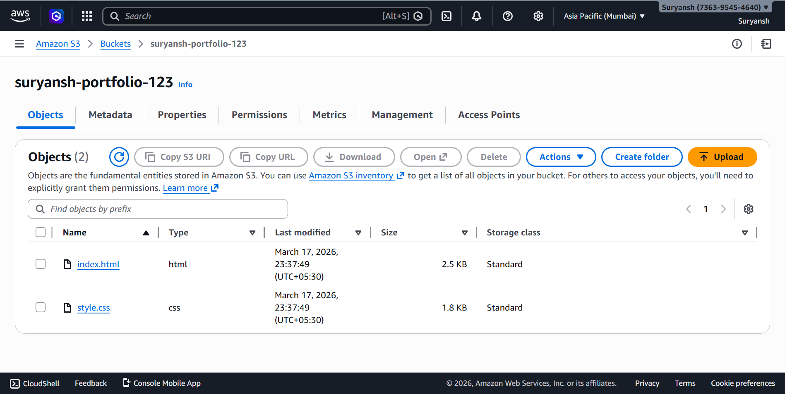

# 🌐 AWS Static Portfolio Website (S3 + CloudFront)

## 📌 Overview

This project demonstrates a **production-grade deployment of a static website** using AWS cloud services.

The goal was to build a system that is:

* Fast (low latency globally)
* Secure (HTTPS + restricted access)
* Scalable (serverless architecture)
* Highly available

---

## 🚀 Live Demo

🔗 https://d2gzqi4ftvqlln.cloudfront.net

---

## 🧠 Problem Statement

Traditional hosting methods often suffer from:

* High latency for global users
* Limited scalability
* Complex infrastructure management
* Lack of built-in security

The objective was to design a **cloud-native solution** that solves these issues efficiently.

---

## 💡 Solution Architecture

The system uses AWS services to deliver optimized performance:

* **Amazon S3** → Stores static website files
* **AWS CloudFront** → Global CDN for fast delivery
* **Origin Access Control (OAC)** → Restricts direct S3 access
* **HTTPS** → Secure content delivery

### 🔁 Flow

1. User requests website via CloudFront
2. Cached content served from nearest edge location
3. If not cached → request forwarded to S3
4. Response cached for future requests

---

## 🏗️ Architecture Highlights

* Serverless deployment (no backend servers)
* Global CDN distribution
* Secure access using OAC
* Optimized caching strategies

---

## 📂 Project Structure

```
portfolio-cloud-site/
│
├── website/
│  ├── index.html
│  ├── portfolio-aws.html
│  ├── portfolio-flask.html
│  └── portfolio-docker.html
│
├── screenshots/
│   ├── s3-hosting.png
│   └── cloudfront-setup.png
│
└── README.md
```

---

## 📸 Screenshots

### S3 Static Website Hosting



### CloudFront Distribution



### Live Website



### S3 Objects



---

## 📈 Impact

* Reduced latency using CDN edge locations
* Improved global accessibility
* Enhanced security with HTTPS & OAC
* Zero server management (fully serverless)

---

## 📚 Key Learnings

* CDN caching and performance optimization
* Secure access control using OAC
* CloudFront + S3 integration
* Designing scalable cloud architectures

---

## 🔗 GitHub Repository

https://github.com/suryansh-singhal/portfolio-cloud-site

---

## 👨‍💻 Author

Suryansh Singhal
MCA Student | Cloud Computing | AWS | DevOps
